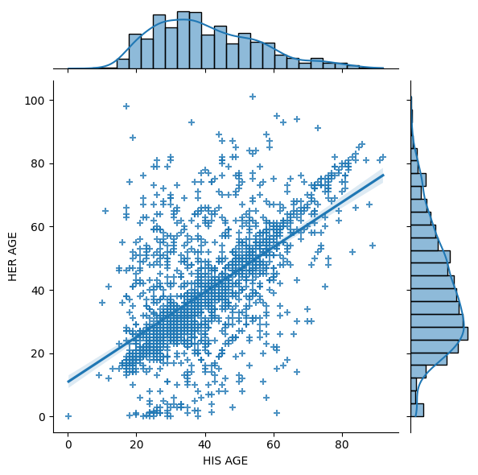
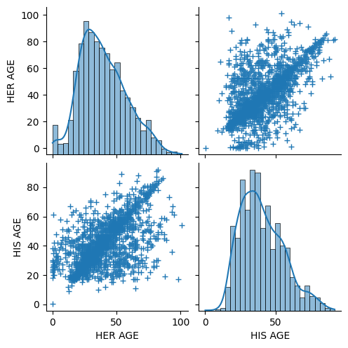
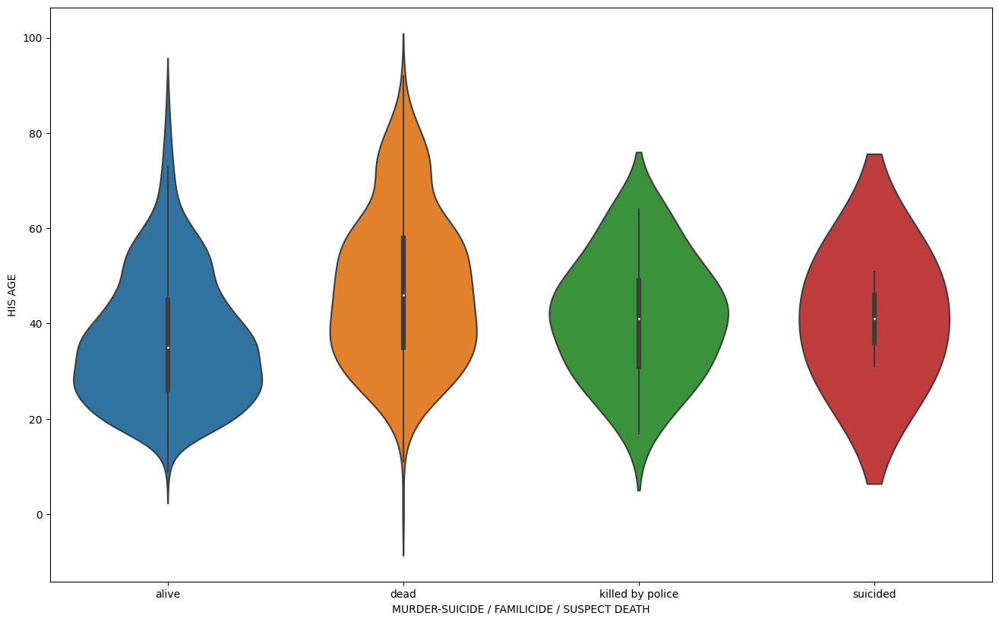

### Dataset

The dataset we have chosen contains information about femicide* in USA in 2018. It is a subset of a larger dataset that has been manually collected and cleaned up by Dawn Wilcox with input from public contributors. It was used only by its creator for the official website of the [Women Count USA: Femicide Accountability Project](https://womencountusa.org/the-databases). The data is presented in Airtables for different periods of time from 1950s. We were able to obtain the CSV file for the 2018 period after emails exchange with the author herself. 

There are 1840 entries, each case has 26 attributes. For our data visualization we are interested in using mainly the following ones: date of death, her name, her age, her race/ethnicity, city, state, relationship, suspect age, suspect race/ethnicity and cause of death. We believe, this dataset is of particular interest for multiple reasons. On top of this, we also have pictures of many of the women that we are going to use in our visualization. 

First, the topic is sensitive and requires us to deeply think about what we want to show and how to do it properly and efficiently. 
Secondly, there is information both about time and space which enriches the visualization possibility.
Finally, the categorical columns such as relationship, or cause of death allow to introduce some filtering.

The data has been collected by a single person, however, some columns aren't consistent and need some cleaning.
Two parsers have been written by now, in order to treat the **ages** columns, and the current health state of the suspect.
The toolset used for that is [the combination of antlr and python](https://faun.pub/introduction-to-antlr-python-af8a3c603d23).

\* *femicide : gender-related killings of women and girls* 

### Problematic

Data collection and visualization play a role in the way we conceive the world and its issues. Missing datasets highlight how power dynamics influences which data is collected. On the topic of gender inequality, feminicides are an example of missing data.  Indeed, the reality of women being killed by men because of their gender is overlooked. In order to address this issue, several women and groups have tackled the task of gathering data. A group of researchers with Catherine D’Ignazio (Data + Feminism Lab @ MIT), Silvana Fumega (ILDA) and Helena Suárez Val (Feminicidio Uruguay) have created ["Data against femicide"](https://datoscontrafeminicidio.net/en/home-2/) to address this issue. In our project we want to work on the next step. Once we have this data how can we visualize it in an interactive way.

Our goal is twofold. First of all, we would like to honor the memory of these women by creating a space for their names and histories. Moreover, we want to highlight the dynamics behind this data with some interactive visualization of aggregation.

People that explore our visualization would be able to connect with who were these women, and understand how unique they were, meanwhile, part of a similar and deathly pattern of violence from men against women. 

### Exploratory Data Analysis

The ages of the victims and the ages of the suspects are highly correlated, as shown here:

We see that the ages of the victims can be really low, with a peak in the first year, whereas the ages of the suspects are centered around 40yo:

We also observe that the health status of the suspect is significantly influenced by their age, and especialy that suspects who were older at the time of the suspected crime were more likely to die during or after the facts:

While we are digging into the rest of the data, some more statistics about the ages:

| Stats  | *His age* | *Her age* |
| ------ |:---------:|:---------:|
| mean   | 40.52     | 39.52     |
| std    | 15.30     | 18.09     |
| median | 38        | 37        |

### Related work

There exist some visualization of femicide data. Dawn Wilcox made a [mapping of the 2018 database](https://l.facebook.com/l.php?u=https%3A%2F%2Fwww.google.com%2Fmaps%2Fd%2Fedit%3Fmid%3D1fD8ocpC4HYuOuNlivmAcxXVxY6_YaeKC%26usp%3Dsharing%26fbclid%3DIwAR1LWcOFOx-1JYxFjgXUhYCisuHHWWfxu2iw_qTNLmT5h8qDd0bXajE6b0M&h=AT1lbDaDjkxvYNrOPhlFrVJYmzhyYsif8g2VevTGqjelpuW9uDF6aYa0RU3I0c6WDQd9AC52HVZ3gIiG7GUjuqnwtB-PCddyxglfiGNUn2gHG-7bO1Mbvwn5ygbWTAotkyw2BZVN63J3MZnP8gPwY8HnuQ&__tn__=-UK-R&c[0]=AT0khRhezKSzP04dh-IrKGjQ8fxYv6L1I36YqKtSPM0o8mTDZi37OjafeJZR38CJRAfUlWY21qt687wZjtib_8sr_Tx0MBCkBhhy8ZaUhywNtX5AVol2Fl-FLO0H_IAPG5It0vGr7yWMsDilX6FYBc-rzRYLdc4rEGYJkL_Q3ixm2ew) using google maps: each point on the map contains a link to the photograph of a victim and information about the committed crime. Also, the same data was used for statistics presented by the creator during the meeting of the [Data against feminicide project](https://datoscontrafeminicidio.net/en/2021-edition/). As another example, María Salguero, who works on the problem of femicide in Mexico, produced a [map](https://mapafeminicidios.blogspot.com/p/inicio.html) with pins corresponding to cases. In this visualization the user can select a pin and see the related information.

However, there are not so many good examples of visualizations for this kind of data. For example, the [tables](https://airtable.com/shrjQBwYvk08cbHu2/tblR739BUJgxxQqrt) are usually large and difficult to explore. Our goal is to create a website that will be not only an interesting and artistic representation of the information, but also a memorial for thousands of victims of male violence against women. We want to focus our design on the idea that every murdered girl and woman was a unique person with her hobbies and interests, and not just a row in the table. The memorials that we have found on the Internet are mostly [databases](https://womencountusa.org/the-databases), the [collections](https://gunmemorial.org) of victims’ photos mentioning some personal information and created with the most basic features of data visualization tools, [see also](https://www.aapf.org/in-memorium-old).

Here are some visualizations that we find interesting and inspiring in context of our project: the [poppy diagram](https://iibawards-prod.s3.amazonaws.com/projects/images/000/000/375/large.jpg?1403857589) showing the number of deaths in different war conflicts throughout the history with a lot of information in the design itself and delicate with respect to the issue at hand. The [web-project](https://www.gabriellemerite.com/portfolio-item/death-at-home/) dedicated to feminicide in France in the spirit of a portfolio highlights how we would like to portray each women and their singularity. The beautiful and meaningful colour-gradient [visualization](https://www.behance.net/gallery/96434017/Noteable-Women?tracking_source=project_owner_other_projects%5C) of portraits of women appearing on banknotes with a non-standard way of representing a timeline is our inspiration for our own timeline. Finally in order to get an ensemble view, the following visualization of [death statistics in Iraq](https://i.pinimg.com/originals/e7/f3/eb/e7f3eb9bea609baab00c24ecc4918c94.jpg) from the New York Times Sunday Opinion caught our attention.

