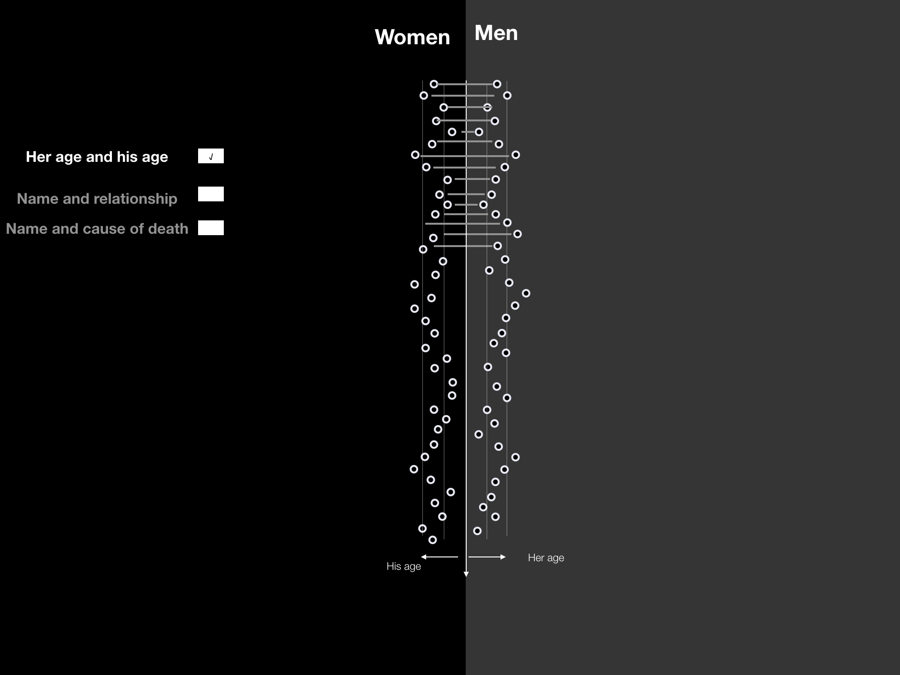
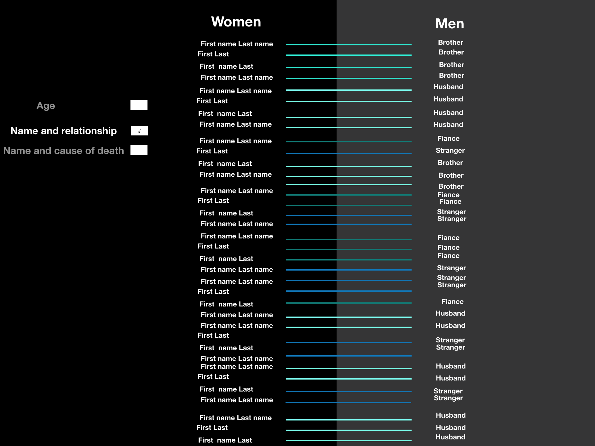
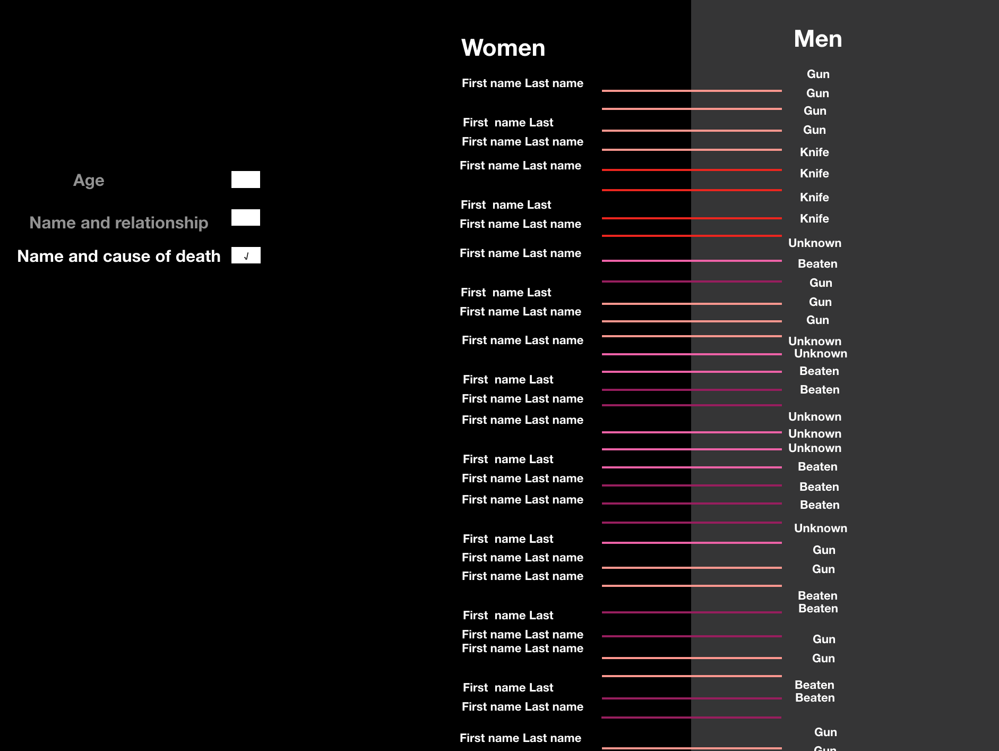
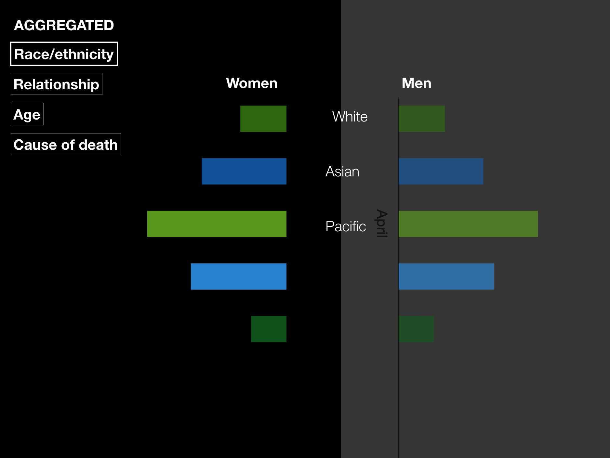
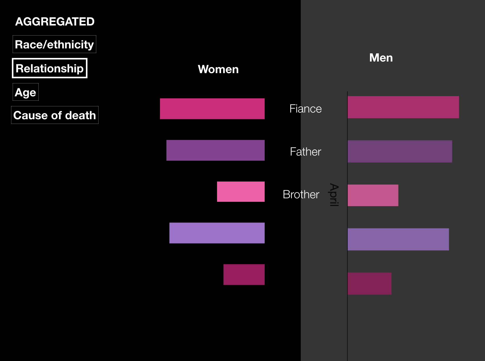

### Project Goals

The goal of our project is to provide a visualization of a feminicide data. The data we visualize has been collected in a political context and can be labelled as “counter data” meaning that it answers a need to reveal a phenomenon usually hidden or marginalized. 

We think about three types of personas for our website. First, the people concerned by feticide because one of their relatives died from it. For this user, our goal is to provide a virtual “memorial” and show that their loved ones are not forgotten. The portrait view design follows this goal focusing on the women data and providing an emotional design. The link to other views allow to contextualize these brutal deaths in a larger issue. We would like to add a ressource page to provide some option for care in this difficult context.

The second and third persona, are respectively a militant in search of data to support  their cause and a curious mind looking to know more after discovering the topic. 
For both these personas, the ensemble view as well as the statistical view let them explore the dataset to get an better idea of who are the victimes and what we know about it. For these personas we would like to add a page with links to groups that organize on the topic.

### Core Visualization

Our minimal viable product includes 3 different visualizations linked with each other: portrait view, ensemble view and statistical view (with an exploratory and a aggregation mode).

The sketches for the portrait view of our visualization are presented below. The idea is to create a "memorial" of each victim. The schematic representation can be seen in Portrait View 1: name of the victim is in the center of the circle, with a picture of the victim if it is present in the dataset. The selected year is shown as a large circle (for now we have only data for 2018, if we get more data, a feature to select year will be added to the page). The date of death is placed on this circle and the position is based on the date. A symbol next to the death date denotes the cause of death. Smaller circles show the age of the woman: number of circles corresponds to the number of years. In the right upper corner name of the state is written inside the contour that has a shape of this state on the map. In the left upper corner the information about victim's race/ethnicity is shown (each circle is a race/ethnicity). Portrait View 2 shows another possible way of presenting this information (the race is in a "constellation" design). Portrait View 3 and Portrait View 4 demonstrate other design ideas for the age and year visualization (age is shown as ticks or rays and year is divided into months).

Portrait View 1           |  Portrait View 2
:-------------------------:|:-------------------------:
  |  
Portrait View 3           |  Portrait View 4
  |  

Here are the sketches for the ensemble view. The starting view (Ensemble View 1) is a plot with as many circles as death cases in the dataset for this year. Below there is a filter by attributes, once a filter is selected the circles become colored based on this filter (Ensemble View 2). If a user clicks directly on a circle he goes to the portrait view of the associated woman. If a particular attribute is selected the graph is colored based on this attribute. The second column next to the filter shows different categories with the distribution (Ensemble View 3). If a user clicks back on race/ethnicity  the initial random view will appear. Clicking on the "Total" or on the "Back to overview" leads back to overview. Note that each circle is linked to one case, and that clicking directly on it will lead to the portrait view.

Ensemble View 1           |  Ensemble View 2
:-------------------------:|:-------------------------:
  |  
Ensemble View 3            

Exploratory Statistical View 1       |   Exploratory Statistical View 2 
:-------------------------:|:-------------------------:
 | 
Exploratory Statistical View 3
 

The goal of the exploratory statistical view is to visualize both the data related to the victims as well as the killers at the same time. The exploratory mode show all the data, i.e. one line per case and highlights the relationship and the murder details. The same data is also presented in an aggregated way to understand what are the tendances on both the victim and the killer data. 

 Aggregated Statistical View 1           |   Aggregated Statistical View 2
:-------------------------:|:-------------------------:
  |  

The aggregated statistical view shows bar chart for data on women and men sides. For categorical data present for both sets (e.g. women race and men race) the graph will be assymetrical. For categorical data that pertain to both gender together (eg relationship) the graph will be symmetrical. For the ordinal data, we will define some categories (e.g. age) for the aggreagation.

### Tools and Lectures Needed

In general: We need the first seven lectures to understand the basics of creating interactive visualizations in the browser. Here is a short overview of lectures and tools that we will need.

"Web Development", "Javascript part 1", "More Javascript", "D3.js" - learning about HTML for structuring the webpage, CSS for the styles of elements, SVG for describing graphics, JS and d3.js for creating complex data visualizations.

"Data" - working with the data: exploration, pre-processing, cleaning, analysis, using for data visualization.

"Interactions", "More interactive d3.js" - learning about adding interactivity to our data visualization, very important for all 3 components of our core visualization

"Mark, channel" - creating different elements of our visualizations to represent items and links.

"Perception colors", "Designing viz", "Do and dont in viz" - studying the basics of design process and designing our visualization.

"Storytelling" - one of the most important letures in the context of our project because our main goal is to honor the memory of women killed by men, as well as to highlight the problem of femicide nowadays.

In particular:

For the portrait view:

For the ensemble view:

For the statistical view: lecture "Tabular data"

### Extra Ideas

To enhance the visualization in our project, we can implement 2 additional views for our website: the timeline view and the map view (see [sketches](https://github.com/com-480-data-visualization/datavis-project-2022-syrinx/blob/main/milestone_imgs/Sketches%20of%20visualization%20ideas.pdf)).

The idea of the timeline view is to present femicide cases in the dimension of time as a story with victims' photographs and names surrounded by women killed around the chosen date. The timeline view is linked with the portrait view by the date of murder element in the portrait view. The timeline can be  zoomed in and out in the 2018 year.

Another idea is to create a map view with a map of crimes committed in different states of the USA in 2018. This visualization would help to show some additional insights into the data (states with the largest/smallest number of femicide cases, the distribution in a space domain). To implement this idea, we would also need to use the material from lectures "Maps" and "Practical maps".

### Project Prototype Review

[Folder with a project prototype](page)
