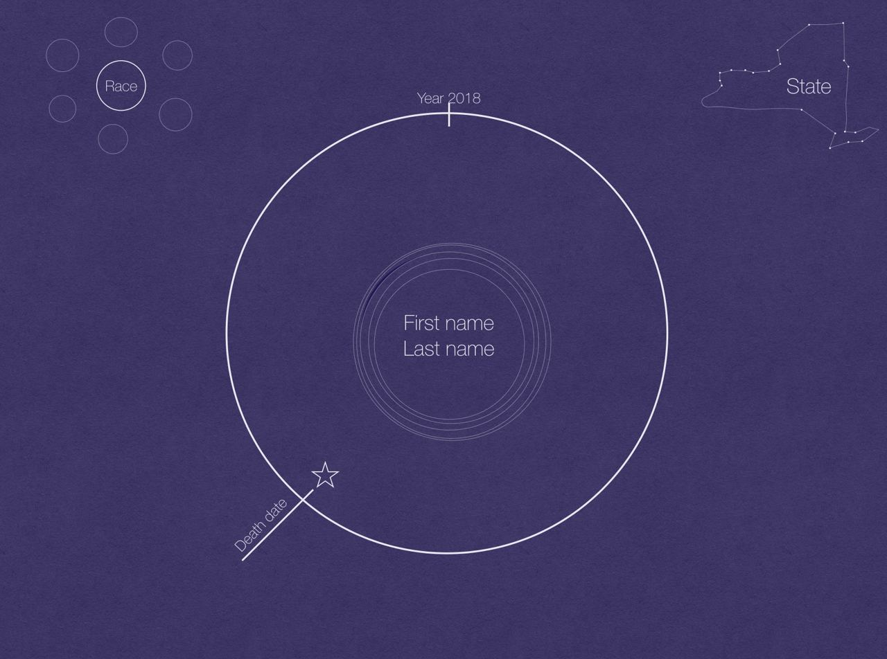
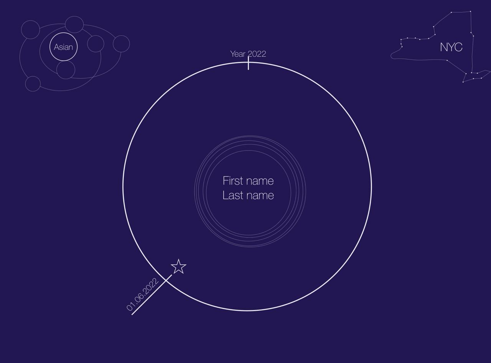
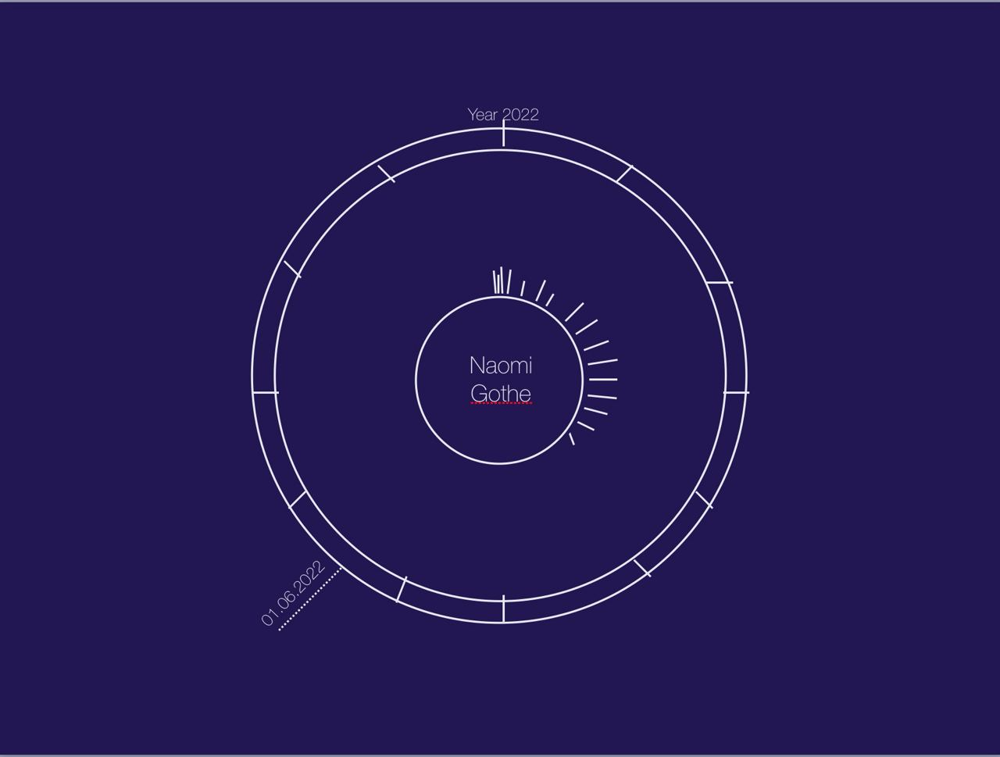
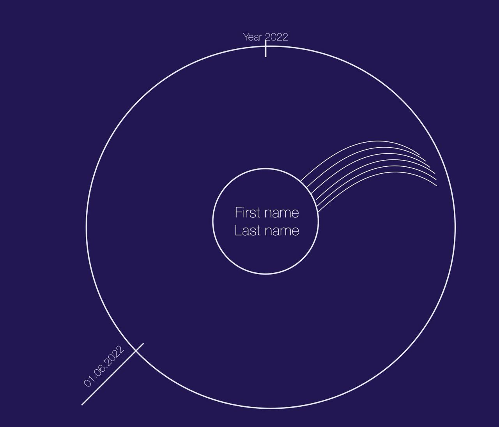
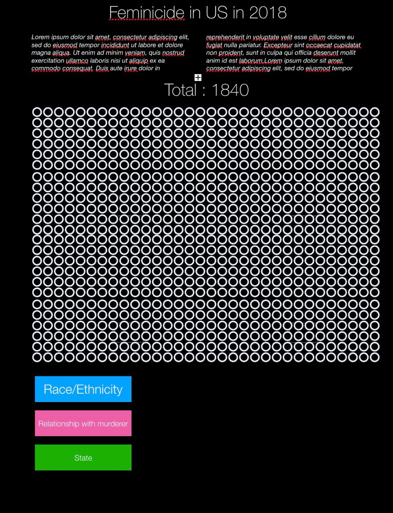
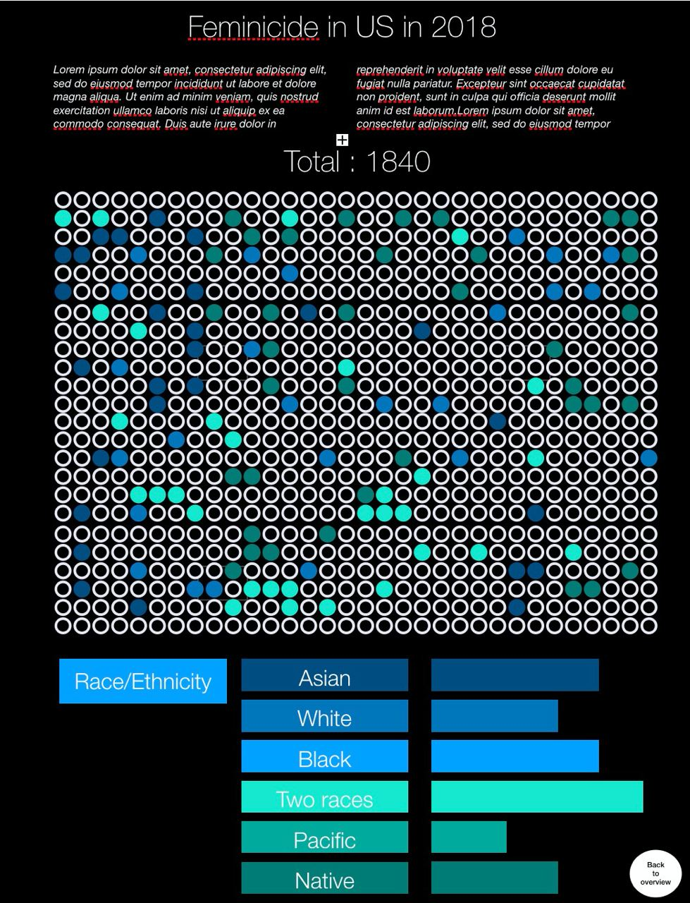
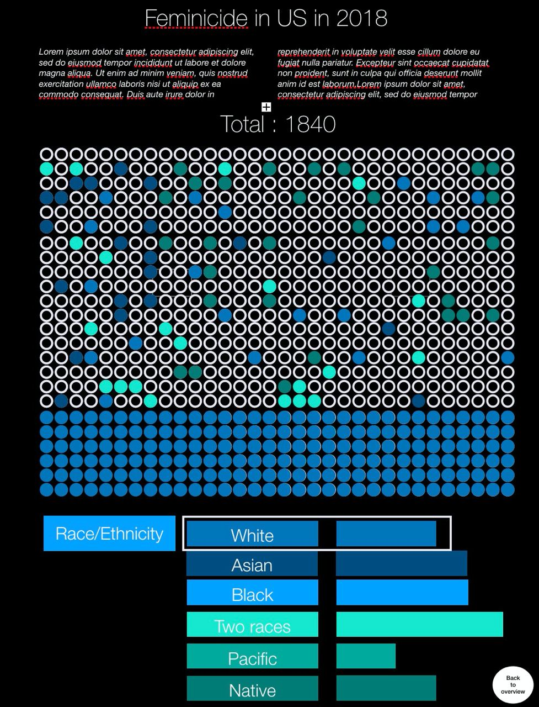

### Project Goals

### Core Visualization

Our minimal viable product includes 3 different visualizations linked with each other: portrait view, ensemble view and statistical view.

The sketches for the portrait view of our visualization are presented below. The idea is to create a "memorial" of each victim. The schematic representation can be seen in Portrait View 1: name of the victim is in the center of the circle, with a picture of the victim if it is present in the dataset. The selected year is shown as a large circle (for now we have only data for 2018, if we get more data, a feature to select year will be added to the page). The date of death is placed on this circle and the position is based on the date. A symbol next to the death date denotes the cause of death. Smaller circles show the age of the woman: number of circles corresponds to the number of years. In the right upper corner name of the state is written inside the contour that has a shape of this state on the map. In the left upper corner the information about victim's race/ethnicity is shown (each circle is a race/ethnicity). Portrait View 2 shows another possible way of presenting this information (the race is in a "constellation" design). Portrait View 3 and Portrait View 4 demonstrate other design ideas for the age and year visualization (age is shown as ticks or rays and year is divided into months).

Portrait View 1           |  Portrait View 2
:-------------------------:|:-------------------------:
  |  
Portrait View 3           |  Portrait View 4
  |  

Here are the sketches for the ensemble view. The starting view (Ensemble View 1) is a plot with as many circles as death cases in the dataset for this year. Below there is a filter by attributes, once a filter is selected the circles become colored based on this filter (Ensemble View 2). If a user clicks directly on a circle he goes to the portrait view of the associated woman. If a particular attribute is selected the graph is colored based on this attribute. The second column next to the filter shows different categories with the distribution (Ensemble View 3). If a user clicks back on race/ethnicity  the initial random view will appear. Clicking on the "Total" or on the "Back to overview" leads back to overview.

Ensemble View 1           |  Ensemble View 2
:-------------------------:|:-------------------------:
  |  
Ensemble View 3
 

### Tools and Lectures Needed

### Extra Ideas

To enhance the visualization in our project, we can implement 2 additional views for our website: the timeline view and the map view (see [sketches](https://github.com/com-480-data-visualization/datavis-project-2022-syrinx/blob/main/milestone_imgs/Sketches%20of%20visualization%20ideas.pdf)).

The idea of the timeline view is to present femicide cases in the dimension of time as a story with victims' photographs and names surrounded by women killed around the chosen date. The timeline view is linked with the portrait view by the date of murder element in the portrait view. The timeline can be  zoomed in and out in the 2018 year.
Another idea is to create a map view with a map of crimes committed in different states of the USA in 2018. This visualization would help to show some additional insights into the data (states with the largest/smallest number of femicide cases, the distribution in a space domain).

### Project Prototype Review

[Folder with a project prototype](page)
